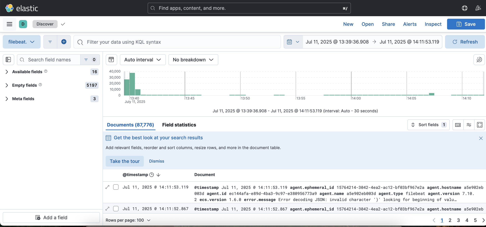
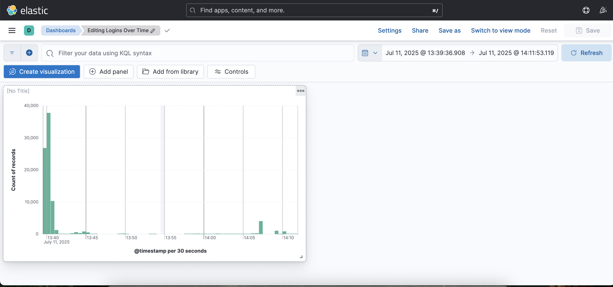
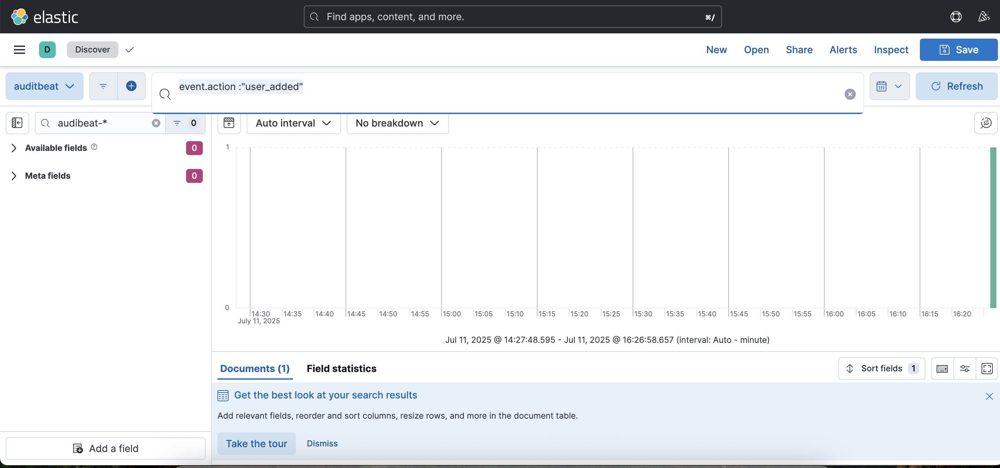

##  CyberSec monitoring stack – ELK + Beats

A hands-on, Docker-based Security Operations Center (SOC) lab environment built for learning and showcasing threat detection, log analysis, and alert engineering.

This project simulates a real-world logging pipeline using Elastic Stack, Auditbeat, Filebeat, and a Fake Logger, providing visibility into endpoint behavior and attacker activity.

---

### Purpose
This project was built to:

- Showcase practical SIEM skills for Security Analyst roles

- Enable real-time host monitoring and log analysis

- Simulate threat behaviors for alert tuning and incident response

- Serve as a portfolio-ready demo of threat detection and visibility engineering

---

###  Stack Components

| Component         | Role                                      |
| ----------------- | ----------------------------------------- |
| **Elasticsearch** | Log storage and search engine             |
| **Kibana**        | Visualize logs and build dashboards       |
| **Auditbeat**     | Host monitoring: users, logins, processes |
| **Filebeat**      | Log shipper for text-based logs           |
| **Fake Logger**   | Simulates alert-worthy events  |

---

###  Features

* Real-time dashboards: Logins, processes, file changes
*  Powerful log filtering and timeline reconstruction
*  Ready for threat detection and alerting
*  Simulated attacker activity using bash scripts
*  Written for security analyst portfolios and labs

---

###  How to Run

```bash
git clone git@github.com:dhamsey3/CyberSec-Docker.git
cd cybersec-docker
docker compose up -d
```

* Access **Kibana**: [http://localhost:5601](http://localhost:5601)
* Elasticsearch: `http://localhost:9200`

---

###  Dashboards Included

| Dashboard Title               | Description                                                 |
| ----------------------------- | ----------------------------------------------------------- |
| `System Activity – Auditbeat` | Visualizes login events, process activity, and file changes |

---

###  Simulating Attacks

This stack includes a **fake logger container** that:

* Writes dummy alerts every 10s
* Can be extended to simulate:

  * File tampering
  * Suspicious logins
  * Privilege escalation

You can also connect to the `auditbeat` container and run:

```bash
docker exec -it auditbeat bash
useradd attacker && su attacker
```

Auditbeat will log it in Kibana!

---

### Ideas for Alerts (Optional Add-on)

* Alert on new user creation
* Alert on execution of `netcat`, `nmap`, `curl`
* Alert if `/etc/passwd` is modified
* Alert if processes run as root

---


---

### Simulated Threat Detection

To test the setup, we simulated a common attacker behavior:

**Command:**
```bash
docker exec -it auditbeat bash
useradd eviluser
```

### 📸 Screenshots

Here are screenshots from the live system to show dashboards and alert detections:

- **Kibana Discover** showing `user_added` event  
- **Auditbeat Dashboard** with real-time activity  
- **Detection Rule Alert** trigger confirmation







